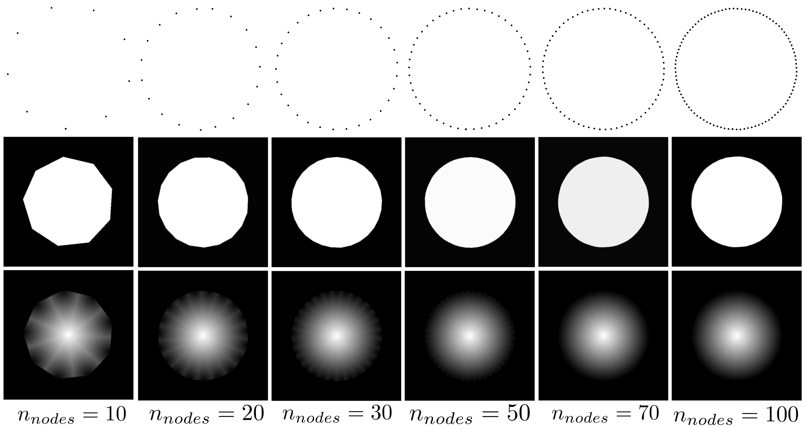

# torch_contour
<figure>
<p align="center">
  
  <figcaption>Example of torch contour on a circle when varying the number of nodes</figcaption>
</p>
</figure>

# Pytorch Layers

This library contains 2 pytorch non trainable layers for performing the differentiable operations of :

1. contour to mask
2. contour to distance map. 

It can therefore be used to transform a polygon into a binary mask or distance map in a completely differentiable way.
In particular, it can be used to transform the detection task into a segmentation task.
The two layers have no learnable weight, so all it does is apply a function in a derivative way.

## Input (Float):

A polygon of size $B \times 2 \times n$ with \
with $n$ the number of nodes and $B$ the batch size


## Output (Float):

A mask or distance map of size $B \times H \times H$.\
with $H$ the Heigh of the distance map or mask and $B$ the batch size

## Important: 

The polygon must have values between 0 and 1. 


## Example:

 ```
from torch_contour.torch_contour import Contour_to_distance_map, Contour_to_mask
import torch
import matplotlib.pyplot as plt

x = torch.tensor([[0.1,0.1],
                  [0.1,0.9],
                  [0.9,0.9],
                  [0.9,0.1]])[None]

Dmap = Contour_to_distance_map(200)
Mask = Contour_to_mask(200)

plt.imshow(Dmap(x).cpu().detach().numpy()[0,0])
plt.show()
plt.imshow(Mask(x).cpu().detach().numpy()[0,0])
plt.show()
```

# Pytorch functions

This library also contains batch torch operations for performing:

1. The area of a batch of polygons
2. The perimeter of a batch of polygons
3. The haussdorf distance between 2 sets of polygons


 ```
from torch_contour.torch_contour import area, perimeter, haussdorf_distance
import torch

polygons1 = torch.tensor([
    [[0, 0], [1, 0], [1, 1], [0, 1]],  # Square
    [[0, 0], [2, 0], [2, 1], [0, 1]]   # Rectangle
], dtype=torch.float32).permute(0, 2, 1)  # Permute to shape (B, 2, N)
polygons2 = torch.tensor([
    [[0, 0], [1, 0], [1, 1], [0, 1]],  # Another Square
    [[0, 0], [2, 0], [2, 2], [0, 2]]   # Another Rectangle
], dtype=torch.float32).permute(0, 2, 1)  # Permute to shape (B, 2, N)


area_ = area(polygons1)
perimeter_ = perimeter(polygons2)
hausdorff_dists = hausdorff_distance(polygons1, polygons2)
```


